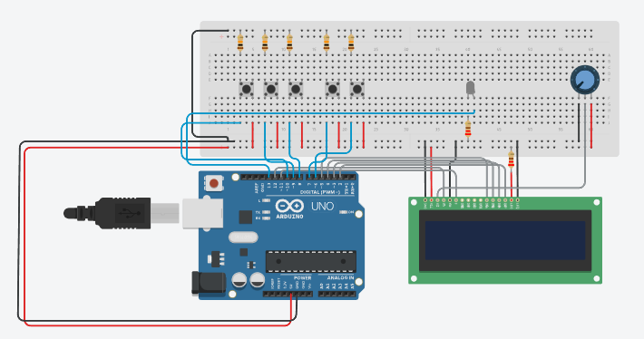

# Simulador de Portas Lógicas com Arduino

Este projeto implementa um **simulador de portas lógicas digitais** (AND, OR, XOR, NAND, NOR, XNOR e NOT) utilizando um **Arduino Uno**, um **display LCD 16x2** e **botões físicos**.

## 📦 Componentes Utilizados

- Arduino Uno
- Display LCD 16x2 (com interface paralela)
- 5 Botões:
  - `botaoAlt` (pino 7): entrada A
  - `botaoNOT` (pino 6): entrada B
  - `botao1`, `botao2`, `botao3` (pinos 10, 9, 8): seleção de operação
- 1 LED no pino 13: indica o resultado da operação
- Jumpers e resistores

## 🧠 Funcionalidades

- Navegação entre menus de operações lógicas:
  - Menu 0: AND / OR / XOR
  - Menu 1: NAND / NOR / XNOR
  - Menu 2: NOT
- Leitura de dois botões como entradas booleanas (A e B)
- Cálculo e exibição da operação lógica selecionada no LCD
- Resultado também indicado via LED (aceso = 1, apagado = 0)
- Impressão de dados no monitor serial para debug

## 📋 Modo de Uso

1. **Selecionar a operação lógica:**
   - Use os botões `botao1`, `botao2` e `botao3` para escolher a operação (ex: AND, OR, XOR).
   - Use `botaoAlt` para alternar entre os menus 0 e 1.
   - Use `botaoNOT` para acessar o menu de operação NOT.

2. **Visualizar resultado:**
   - Pressione `botaoAlt` para representar o valor lógico de A.
   - Pressione `botaoNOT` para representar o valor lógico de B.
   - O resultado da operação será exibido no LCD e refletido no LED.

3. **Retornar ao menu:**
   - Pressione qualquer botão de seleção (`botao1`, `botao2`, `botao3`) para voltar ao menu principal.

## 🖥️ Serial Monitor

O monitor serial exibe dados no seguinte formato:
```
[LCD]menuAtual|opcaoAtual|A|B|resultado
```

Exemplo:
```
[LCD]AND / OR / XOR|AND|0|1|0
```

## 📁 Estrutura do Código

- `setup()`: inicializa o LCD, pinos e comunicação serial.
- `loop()`: alterna entre modo de menu e visualização do resultado lógico.
- Funções básicas de lógica booleana são usadas diretamente (`&&`, `||`, `^`, `!`).

## Esquema do Circuito


